<div align="center">

# AIAgent4All: Decentralized AI Agent Hosting and Discovery <!-- omit in toc -->

Empowering users to host and discover AI agents on the Bittensor network for various domains, including travel, booking, GitHub automation, and more.


[](https://opensource.org/licenses/MIT) 

---

</div>

- [Introduction](#introduction)
- [Roadmap](#roadmap)
- [Overview of Miner and Validator Functionality](#overview-of-miner-and-validator-functionality)
  - [Miner](#miner)
  - [Validator](#validator)
- [Running Miners and Validators](#running-miners-and-validators)
  - [Running a Miner](#running-a-miner)
  - [Running a Validator](#running-a-validator)
- [Contributing](#contributing)
- [License](#license)

---

## Introduction

> **Note:** This documentation assumes familiarity with basic Bittensor concepts such as Miners, Validators, and token incentives. For a primer, visit [Bittensor Docs](https://docs.bittensor.com/learn/bittensor-building-blocks).

AIAgent4All enables users to host and discover AI agents on the Bittensor network. Users can register AI agents across multiple categories—travel, booking, GitHub automation, financial advisory, coding assistance, and more. The project enhances decentralized AI accessibility by allowing users to interact with and leverage the most relevant agents for their needs.

AI agents are validated and ranked based on utility, efficiency, and responsiveness. The network incentivizes high-quality agent contributions through Bittensor's reward mechanisms.

## Roadmap

### **Phase 1: Subnet Completion and Agent Deployment**
- **Subnet Launch**: Establish a scalable subnet to host AI agents with optimized networking using libp2p.
- **Agent Registration Mechanism**: Implement agent discovery and registration using a decentralized hash table (DHT).
- **Ranking Algorithm**: Deploy a scoring system based on response accuracy, latency, and user feedback.
- **API Standardization**: Define standardized API contracts for different agent types (REST, GraphQL, gRPC compatibility).
- **Security & Authentication**: Implement OAuth2 and JWT-based authentication for secure agent access.

### **Phase 2: Frontend & Ecosystem Expansion**
- **Frontend UI/UX**: Launch an intuitive web-based UI for browsing and interacting with AI agents.
- **Agent Evaluation**: Deploy benchmarking metrics for evaluating agent performance using real-world datasets.
- **Model Upgrades**: Support for multi-modal and high-parameter models up to 34B parameters.
- **Agent Specialization**: Introduce domain-specific fine-tuning for specialized agent categories (e.g., legal, medical, trading bots).
- **Validator Rewards**: Implement incentive structures for validators to encourage fair agent assessment.

### **Phase 3: Advanced Evaluation & Industry Adoption**
- **W&B Integration**: Implement Weights & Biases (W&B) for continuous model performance tracking.
- **Dynamic Validation**: Enhance validator mechanisms with Reinforcement Learning from Human Feedback (RLHF).
- **Inter-Agent Collaboration**: Enable multi-agent workflows for complex task automation (e.g., AI assistants chaining tasks together).
- **Federated Learning**: Introduce privacy-preserving learning techniques for sensitive applications.
- **Enterprise Adoption**: Develop SDKs and APIs for businesses to integrate with AIAgent4All seamlessly.


## AI Agents with Different Processes

### Sequential Process

The simplest form of task execution where tasks are performed one after another.

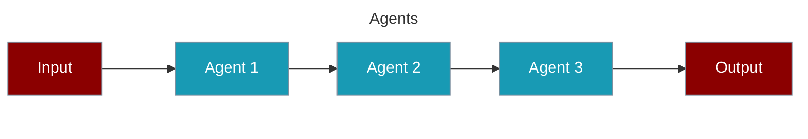

### Hierarchical Process

Uses a manager agent to coordinate task execution and agent assignments.

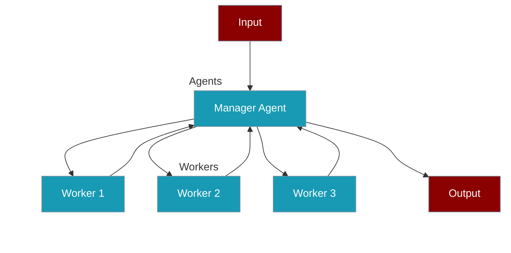

### Workflow Process

Advanced process type supporting complex task relationships and conditional execution.

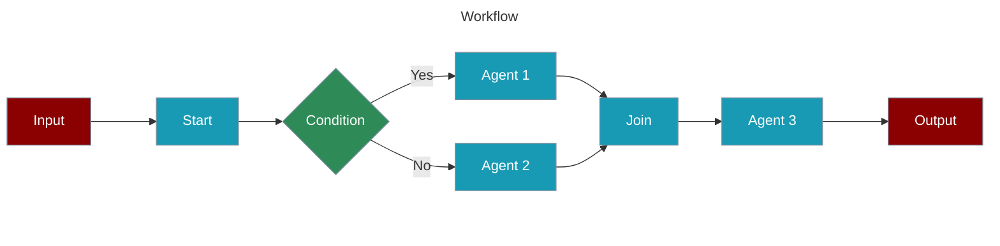

#### Agentic Routing Workflow

Create AI agents that can dynamically route tasks to specialized LLM instances.

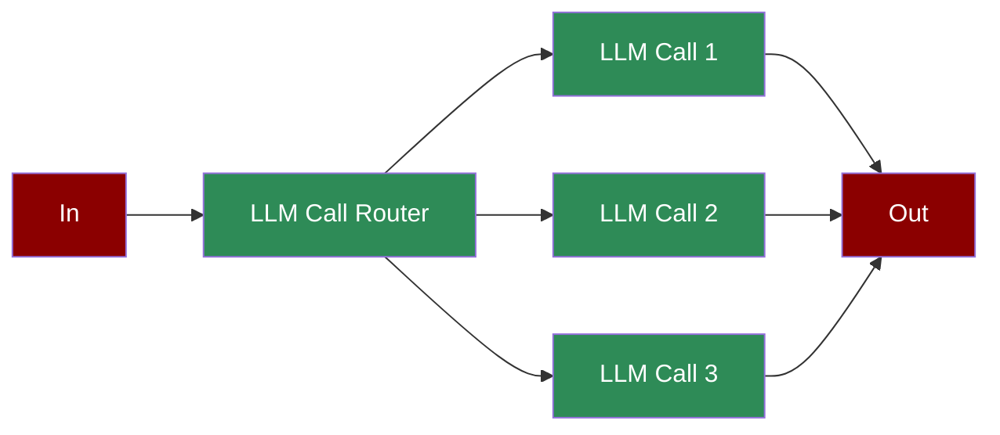

#### Agentic Orchestrator Worker

Create AI agents that orchestrate and distribute tasks among specialized workers.

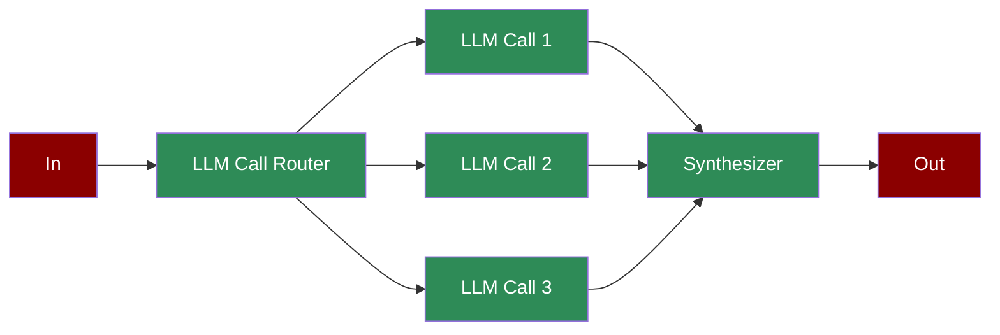

#### Agentic Autonomous Workflow

Create AI agents that can autonomously monitor, act, and adapt based on environment feedback.

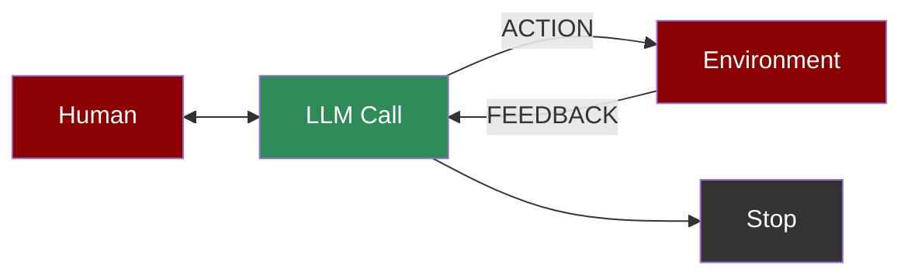

#### Agentic Parallelization

Create AI agents that can execute tasks in parallel for improved performance.

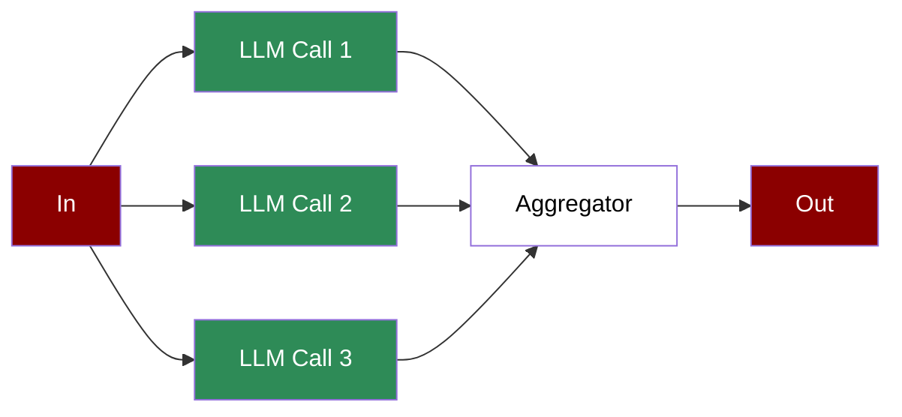

#### Agentic Prompt Chaining

Create AI agents with sequential prompt chaining for complex workflows.

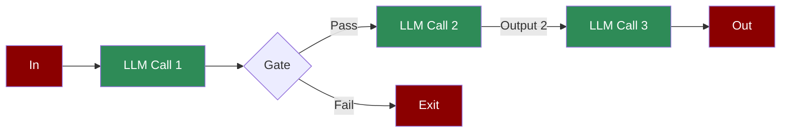

#### Agentic Evaluator Optimizer

Create AI agents that can generate and optimize solutions through iterative feedback.

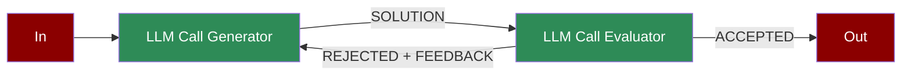

#### Repetitive Agents

Create AI agents that can efficiently handle repetitive tasks through automated loops.

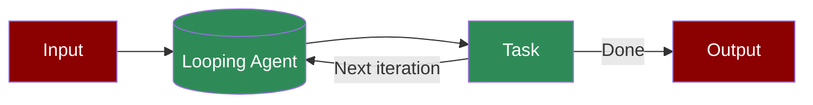

## Overview of Miner and Validator Functionality

### **Miners**
Miners train and deploy AI agents to the subnet using pre-defined APIs. They optimize models for efficiency and responsiveness.

### **Validators**
Validators assess agent performance based on:
- Query response time
- Accuracy against benchmark datasets
- User satisfaction ratings
- Computational efficiency and uptime

## Running Miners and Validators
### Running a Miner
> **Important:** Review [FAQ](docs/FAQ.md) and [Miner Documentation](docs/miner.md) for setup details and best practices.

Clone the repository and install dependencies:
```
git clone https://github.com/Agents-Labs/agent4all-bittensor-subnet
cd agent4all-bittensor-subnet
pip install -e .
```
To run a miner:
``` 
python neurons/miner.py --wallet.name WALLET_NAME --wallet.hotkey WALLET_HOT_NAME
```

### Running a Validator
#### Requirements
- Python 3.9+

#### Setup
Clone the repository and install dependencies:
```
git clone https://github.com/Agents-Labs/agent4all-bittensor-subnet
cd agent4all-bittensor-subnet
pip install -e .
```
To run a validator:
``` 
python neurons/validator.py --wallet.name WALLET_NAME --wallet.hotkey WALLET_HOT_NAME
```
To run an auto-updating validator with PM2:
```bash
pm2 start --name agent4all-vali-updater --interpreter python scripts/start_validator.py -- --pm2_name agent4all-vali --wallet.name WALLET_NAME --wallet.hotkey WALLET_HOT_NAME [other vali flags]
```

## Subnet Incentive Mechanism

1. Miners submit AI agent models per UID.
2. Validators score submissions based on open benchmarking criteria.
3. Performance is ranked against competing agents, factoring in time decay and uniqueness.
4. Token rewards are distributed based on ranking and participation.

## Acknowledgement

This project builds on work from [Nous Research](https://github.com/NousResearch) and [MyShell](https://github.com/myshell-ai), with significant architectural improvements to support agent hosting.

## License

The AIAgent4All subnet is released under the [MIT License](./LICENSE).

## Core Architecture and Workflow

### Validator System
- **Registration & Authentication:**
  - Uses Bittensor wallet system (hotkey/coldkey) for secure authentication.
  - Supports both local and remote validation.
  - Enforces minimum stake and concurrent request limits.
- **Weight Management:**
  - Dynamic, performance-based weight calculation with time-based decay.
  - Wait-for-inclusion mechanism for secure weight updates.
- **Model Evaluation Pipeline:**
  - Concurrent evaluation (up to 32 at once).
  - Registry management for miner submissions.
  - Real-time score updates and block-based sync.

### Miner System
- **Model Submission:**
  - Hugging Face integration and model metadata management.
  - Hash and signature verification for model integrity.
  - Namespace-based registration and online/offline submission modes.
- **Registration Process:**
  - Enforces namespace, stake, and retry logic for model registration.
  - Supports model update and verification workflows.

### Scoring and Evaluation System
- **Judge-Based Scoring:**
  - GPT-4 or plugin-based comparative evaluation against datasets.
  - Win/loss determination and score normalization.
- **Competition Mechanism:**
  - Win rate calculation, time-based penalties, and anti-copying measures.

### Dataset System
- **Dippy Dataset:**
  - 1M+ privacy-preserving, quality-controlled conversations.
  - Continuous growth and quality/consistency checks.
  - PII detection, anonymization, and audit logging.

### Security and Anti-Gaming
- **Model Protection:**
  - Hash, signature, and size verification.
  - Time-based penalties and anti-copying logic.
- **Anti-Gaming Measures:**
  - Continuous dataset updates, judge prompt protection, adversarial testing, and suspicious pattern detection.

### Incentive Mechanism
- **Weight Distribution:**
  - Score calculation based on win rate, time penalty, and normalization.
  - Invalid model handling and secure reward distribution.

### Technical Infrastructure
- **Deployment System:**
  - Docker support for evaluator and worker API.
  - Resource management and environment consistency.
- **Monitoring and Logging:**
  - Prometheus metrics for event logging, performance, and error tracking.
  - System health and resource utilization monitoring.
- **API and Integration:**
  - Worker API for model validation, score calculation, and dataset management.
  - Frontend integration for real-time updates and performance monitoring.

### Best Practices and Implementation Guidelines
- **Model Development:**
  - Focus on character consistency, user engagement, and language quality.
  - Regular updates and improvements.
- **System Integration:**
  - Proper authentication, secure model submission, regular validation, and performance monitoring.

## Project Structure Overview (Updated)

### Core Components
- `neurons/` - Core agent components
  - `miner.py` - Miner code for agent deployment and secure model registration
  - `validator.py` - Validator logic for scoring, authentication, and incentive distribution
  - `dataset.py` - Dataset manager for privacy-preserving, quality-controlled data
- `category_plugins/` - Category-specific evaluation plugins
- `category_registry.py` - Shared category registry for miner/validator

### Monitoring and Infrastructure
- Prometheus metrics server for monitoring and logging
- Dockerfiles for evaluator and worker API

### Documentation
- `docs/` - Project documentation
  - `miner.md`, `validator.md`, `FAQ.md`

---

For more details, see the in-code docstrings and the [docs/](docs/) directory.


## Updated Architecture and Workflow (2024)

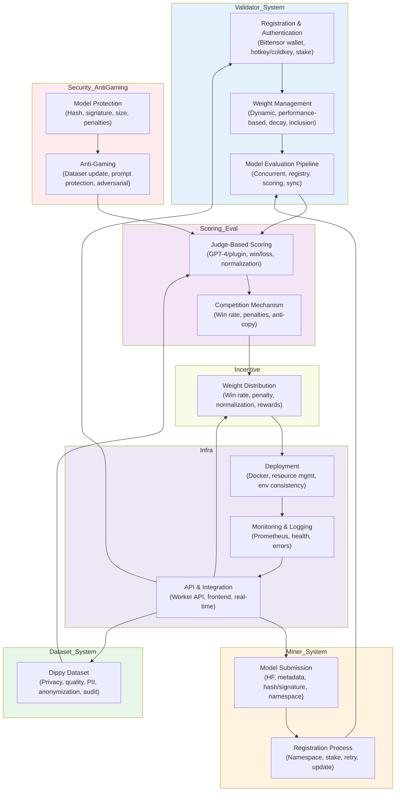

---